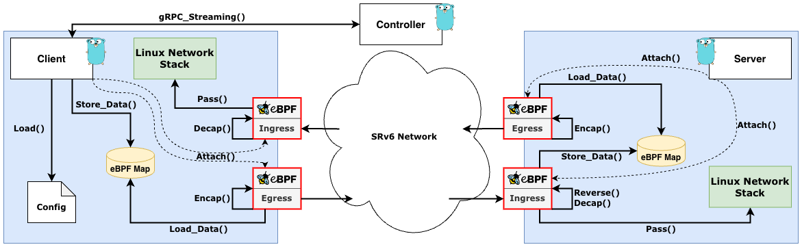
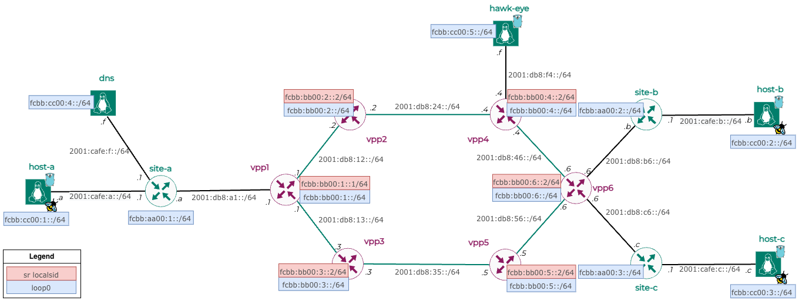

# HawkWing
> Leveraging eBPF for Intent-Driven Application-Centric End-to-End Segment Routing over IPv6

This work was conducted as Master Thesis at the Eastern Switzerland University of Applied Sciences.  
The thesis is available [here](docs/Master_Thesis.pdf), and the presentation is available [here](docs/Master_Thesis_Presentation.pdf).

## Overview
HawkWing is a prototype implementation of Intent-Driven Application-Centric End-to-End Segment Routing over IPv6. It leverages eBPF to implement the data plane of the prototype. The control plane is implemented in Golang. 
HawkWing is a versatile tool that operates in both client and server modes, offering a dynamic and adaptive approach to network packet handling and routing. 

## Features
- **Intent-driven routing**: HawkWing can route packets based on the intent of the user. This is achieved by either using the manually configured SID list in the configurationf file or by contacting the HawkEye server to retrieve the SID list for the given destination address and intents. 
- **Application-centric routing**: HawkWing can route packets based on the destination application. This is achieved by storing a unique mapping of destination IPv6 address and application port. Outgoing packets are then matched against this mapping and routed according to the corresponding SID list. On the server side this mapping is automatically generated by HawkWing, by inspecting the incoming packets and extracting the source IPv6 address and application port together with the SID list. This unique tripple is then stored, with the SID list reversed, as outgoing mapping on the server.
- **End-to-end Segment Routing**: HawkWing routes packets based on the IPv6 Segment Routing Header (SRH). The encapsulation and decapsulation is done directly on the server and client, respectively. This end-to-end approach allows for a more flexible and dynamic routing of packets. More specifically, Segment Routing policies on edge router can be avoided, as the routing is done directly on the client and server.

## Architecture
HawkWing is composed of two main components, namely the client and server. The client is responsible for the configuration, controller communication, and packet encapsulation/decapsulation. The server is responsible for the encapsulation/decapsulation and reversing of the SID list. More information can be found in the [thesis](docs/Master_Thesis.pdf), and the [presentation](docs/Master_Thesis_Presentation.pdf).
.

## Development Network
HawkWing's development environment is crafted using VPP (Vector Packet Processing) and Linux namespaces. This setup was chosen for its robustness and flexibility, allowing for seamless development and testing directly on the server within isolated namespaces. The development environment is depicted in the figure below.


## Configuration Structure

The Hawkwing configuration is structured as follows:

| Section | Subsection | Key | Description |
| ------- | ---------- | --- | ----------- |
| `client_ipv6_address` | | | The IPv6 address of the client. When not defined it takes the first address of the given interface. |
| `hawkeye` | | `enabled` | Enable/disable HawkEye controller. |
| | | `address` | The IPv6 address of the HawkEye controller. |
| | | `port` | The port number on which the HawkEye controller listens. |
| `services` | | `service1`, `service2`, `service3`, ... | Service-specific configurations. Each service has its own set of configurations. |
| | `domain_name` | | The domain name of the service. |
| | `ipv6_addresses`| | List of IPv6 addresses assigned to the service (optional).                                                 |
| | `applications` | | List of applications within the service. Each application has its own set of configurations. |
| | | `port` | The port number for the application. |
| | | `sid` | List of Segment IDs (SIDs) for SRv6 routing (when defining an intent, optional). |
| | | `intents` | List of intents for segment routing. Each intent has its own set of configurations. |
| | | `intent` | The type of intent (e.g., `sfc`, `flex-algo`, `high-bandwidth`, `low-bandwidth`, `low-latency`). |
| | | `functions` | List of functions for the `sfc` intent. |
| | | `flex_algo_number`| The algorithm number for the `flex-algo` intent. |
| | | `min_value` | The minimum value for `high-bandwidth`, `low-bandwidth`, and `low-latency` intents. |
| | | `max_value` | The maximum value for `high-bandwidth`, `low-bandwidth`, and `low-latency` intents. |

### Intent Specification
The intent specification is a list of intents for segment routing. Each intent has its own set of configurations. The intent specification is structured as follows:

| Intent | Description |
| ------ | ----------- |
| `sfc` | Service Function Chaining (SFC) intent. When defining an SFC intent it has to be always the first one in the list. |
| `flex-algo` | Flex Algorithm intent. When defining an SFC intent it has to be the first one, or the second one after an SFC intent. |
| `high-bandwidth` | High Bandwidth intent. |
| `low-bandwidth` | Low Bandwidth intent. |
| `low-latency` | Low Latency intent. |

### Configuration Example
The following example shows a configuration file for a service with three applications. The first application has two SIDs for SRv6 routing and two intents, namely SFC and Flex Algorithm. The second application has one intent, namely High Bandwidth. The third application has four intents, namely Flex Algorithm, Low Bandwidth, Low Latency, and SFC. The third application also has a list of IPv6 addresses assigned to it.

```yaml
---
hawkeye:
  enabled: true
  address: fcbb:cc00:5::f
  port: 5001
services:
  service1:
    domain_name: service1.com
    applications:
      - port: 80
        sid:
          - fcbb:bb00:1::2
          - fcbb:bb00:2::2
        intents:
          - intent: sfc
            functions:
              - function1
              - function2
      - port: 8080
        intents:
          - intent: flex-algo
            flex_algo_number: 1
  service2:
    domain_name: service2.com
    applications:
      - port: 1433
        sid:
          - fcbb:bb00:2::2
          - fcbb:bb00:3::2
        intents:
          - intent: high-bandwidth
            min_value: 1
            max_value: 2
  service3:
    ipv6_addresses:
      - fcbb:cc00:4::a
      - fcbb:cc00:4::b
      - fcbb:cc00:4::c
    applications:
      - port: 443
        intents:
          - intent: flex-algo
            flex_algo_number: 1
          - intent: low-bandwidth
            min_value: 1
            max_value: 2
          - intent: low-latency
            min_value: 1
            max_value: 2
      - port: 8080
        intents:
          - intent: sfc
            functions:
              - function1
              - function2
      - port: 18
        intents:
          - intent: low-bandwidth
      - port: 19
        intents:
          - intent: low-bandwidth
          
```

## Getting Started
To use HawkWing, you can either build it from source or use the pre-built binaries.

### Prerequisites
- Linux Kernel 5.15 or higher
- Privileged access to the client and server
- IPv6 connectivity between the client and server
- Configuration file (see [Configuration Structure](#configuration-structure))

### Client-Mode
On the client the application can be started using the following command:
```bash
sudo hawkwing client -i <interface> --config <config-file>
```

### Server-Mode
On the server the application can be started using the following command:
```bash
sudo hawkwing server -i <interface>
```

### Using Docker
HawkWing can also be run using Docker. To run HawkWing using Docker, use the following commands:  
  
On the client:
```bash
docker run ghcr.io/hawkv6/hawkwing --privileged --network=host -v /path/to/config:/config hawkwing client -i <interface> --config /config/config.yaml 
```
On the server:
```bash
docker run ghcr.io/hawkv6/hawkwing --privileged --network=host hawkwing server -i <interface>
```
